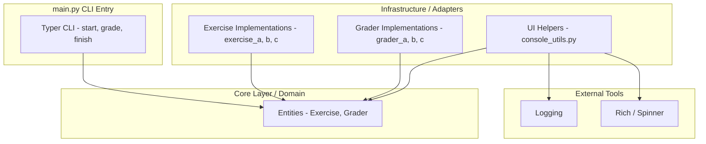

# Lab - CLI framework



---

- **main.py / CLI Entry**
  + Solo coordina la ejecución, invoca servicios o entidades según el comando.

- **Core Layer**
  + `Entities`: clases puras del dominio (`Exercise`, `Grader`).
  + `Services`: opcional, orquesta operaciones complejas sobre las entidades.

- **Infrastructure / Adapters**
  + `exercise_*` y `grader_*`: implementaciones concretas de cada ejercicio y grader.
  + `console_utils.py`: helpers de UI (spinners, logging).

- **External Tools**
  + Librerías externas usadas por infrastructure y main (Rich, logging).

### Mejoras
- En modo DEBUG, si varios mensajes tienen el mismo timestamp, agruparlos:
```python
prefix = Text(" " * len(f"[{datetime.now().strftime("%m/%d/%y %H:%M:%S")}]"), style="default")
instance.debug_msg.append(
  Text.assemble(
    prefix,
    (" DEBUG    ", "green"),
    (msg, "default"),
  )
)
```

