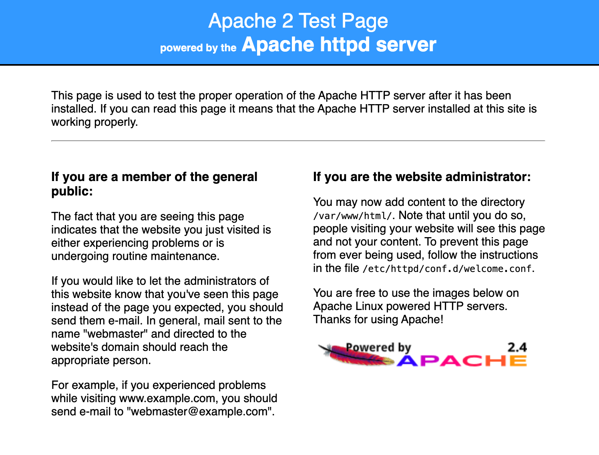

# 🧩 6: Configuración de Servidores Web

## 🎯 Objetivo general

Al finalizar este módulo, serás capaz de:

1. Instalar y configurar Apache usando un **rol completo**
2. Instalar y configurar Nginx como **reverse proxy** hacia Apache
3. Usar **templates**, **handlers**, **variables** y **roles**
4. Ejecutar todo en un **playbook** que orquesta ambos roles

---

## 📘 **Instalación y configuración de Apache usando roles**

### 🏗️ Estructura del rol

```
roles/
  apache/
    tasks/
      main.yml
      install.yml
    templates/
      httpd.conf.j2
    handlers/
      main.yml
    defaults/
      main.yml
```

**defaults/main.yml**
```yaml
apache_port: 8080
apache_docroot: /var/www/html
```

**templates/httpd.conf.j2**
```jinja2
Listen {{ apache_port }}

<VirtualHost *:{{ apache_port }}>
  DocumentRoot "{{ apache_docroot }}"
  ErrorLog /var/log/httpd/error.log
  CustomLog /var/log/httpd/access.log combined
</VirtualHost>
```

**tasks/main.yml**
```yaml
- name: Cargamos modulo de instalacion
  ansible.builtin.include_tasks: install.yml
```

**tasks/install.yml**
```yaml
- name: Instalar Apache
  ansible.builtin.package:
    name: httpd
    state: present

- name: Asegurar que Apache esta habilitado y activo
  ansible.builtin.service:
    name: httpd
    enabled: yes
    state: started

- name: Desactivar el listener por defecto en Apache
  ansible.builtin.replace:
    path: /etc/httpd/conf/httpd.conf
    regexp: '^Listen 80'
    replace: '# Listen 80'

- name: Copiar configuracion de Apache
  ansible.builtin.template:
    src: httpd.conf.j2
    dest: /etc/httpd/conf.d/main.conf
  notify: "Reiniciar Apache"

# Ejecuta todos los handlers pendientes, en vez de
# esperar hasta que se terminen las tasks en el host
- meta: flush_handlers
```

**handlers/main.yml**
```yaml
- name: Reiniciar Apache
  ansible.builtin.service:
    name: httpd
    state: restarted
```

---

## 📘 **Instalación y configuración de Nginx reverse proxy**

### 🏗️ Estructura del rol

```
roles/
  nginx/
    tasks/
      main.yml
      install.yml
    templates/
      nginx.conf.j2
      reverse-proxy.conf.j2
    handlers/
      main.yml
    defaults/
      main.yml
```

**defaults/main.yml**
```yaml
nginx_listen_port: 80
nginx_upstream_host: "127.0.0.1"
nginx_upstream_port: 8080
```

**templates/reverse-proxy.conf.j2**
```jinja
server {
    listen {{ nginx_listen_port }};
    location / {
      proxy_pass http://{{ nginx_upstream_host }}:{{ nginx_upstream_port }};
      proxy_set_header Host $host;
      proxy_set_header X-Real-IP $remote_addr;
    }
}
```

**templates/nginx.conf.j2**
```
# For more information on configuration, see:
#   * Official English Documentation: http://nginx.org/en/docs/
#   * Official Russian Documentation: http://nginx.org/ru/docs/

user nginx;
worker_processes auto;
error_log /var/log/nginx/error.log;
pid /run/nginx.pid;

# Load dynamic modules. See /usr/share/doc/nginx/README.dynamic.
include /usr/share/nginx/modules/*.conf;

events {
    worker_connections 1024;
}

http {
    log_format  main  '$remote_addr - $remote_user [$time_local] "$request" '
                      '$status $body_bytes_sent "$http_referer" '
                      '"$http_user_agent" "$http_x_forwarded_for"';

    access_log  /var/log/nginx/access.log  main;

    sendfile            on;
    tcp_nopush          on;
    tcp_nodelay         on;
    keepalive_timeout   65;
    types_hash_max_size 2048;

    include             /etc/nginx/mime.types;
    default_type        application/octet-stream;

    # Load modular configuration files from the /etc/nginx/conf.d directory.
    # See http://nginx.org/en/docs/ngx_core_module.html#include
    # for more information.
    include /etc/nginx/conf.d/*.conf;

# Settings for a HTTP server.
#    server {
#        #listen       80 default_server;
#        #listen       [::]:80 default_server;
#        server_name  _;
#        root         /usr/share/nginx/html;
#
#        # Load configuration files for the default server block.
#        include /etc/nginx/default.d/*.conf;
#
#        location / {
#        }
#
#        error_page 404 /404.html;
#            location = /40x.html {
#        }
#
#        error_page 500 502 503 504 /50x.html;
#            location = /50x.html {
#        }
#    }

# Settings for a TLS enabled server.
#
#    server {
#        listen       443 ssl http2 default_server;
#        listen       [::]:443 ssl http2 default_server;
#        server_name  _;
#        root         /usr/share/nginx/html;
#
#        ssl_certificate "/etc/pki/nginx/server.crt";
#        ssl_certificate_key "/etc/pki/nginx/private/server.key";
#        ssl_session_cache shared:SSL:1m;
#        ssl_session_timeout  10m;
#        ssl_ciphers PROFILE=SYSTEM;
#        ssl_prefer_server_ciphers on;
#
#        # Load configuration files for the default server block.
#        include /etc/nginx/default.d/*.conf;
#
#        location / {
#        }
#
#        error_page 404 /404.html;
#            location = /40x.html {
#        }
#
#        error_page 500 502 503 504 /50x.html;
#            location = /50x.html {
#        }
#    }

}
```

**tasks/main.yml**
```yaml
- name: Cargamos modulo de instalacion
  ansible.builtin.include_tasks: install.yml
```

**tasks/install.yml**
```yaml
---
- name: Instalar Nginx
  ansible.builtin.package:
    name: nginx
    state: present

- name: Copiar config principal
  ansible.builtin.template:
    src: nginx.conf.j2
    dest: /etc/nginx/nginx.conf

- name: Copiar config reverse proxy
  ansible.builtin.template:
    src: reverse-proxy.conf.j2
    dest: /etc/nginx/conf.d/reverse-proxy.conf
  notify: "Recargar Nginx"

- name: Asegurar Nginx activo
  ansible.builtin.service:
    name: nginx
    enabled: yes
    state: started
```

**handlers/main.yml**

```yaml
- name: Recargar Nginx
  ansible.builtin.service:
    name: nginx
    state: reloaded
```

---

## 📘 **Playbook principal**

Encargado de orquestar la ejecución de los roles

**webservers.yml**
```yaml
---
- hosts: webservers
  gather_facts: false
  become: yes
  roles:
    - role: apache
    - role: nginx
```

Puntos clave:

- Cómo **un rol depende de la salida del otro** (`apache_port` → reverse proxy '`nginx_upstream_port`')
- Cómo **pasar variables al rol** correctamente (su scope es a nivel de play)
- Cómo manejar **handlers independientes**
- Cómo separar responsabilidades: **Apache** sirve contenido, **Nginx** lo expone

!!! info
    Tras ejecutar **sin errores** el playbook `ansible-playbook webservers.yml` deberias ver la página por defecto de Apache en [`http://localhost:8080`](http://localhost:8080)

    { width="300px" }

---

## 📚 **Ejercicio 1 — Cambiar el puerto de Apache**

Cambiar el puerto por defecto de Apache:
```yaml
apache_port: 9090
```
→ Modificar el puerto de upstream en la configuración de nginx también

??? tip "Solucion"
    **apache/defaults/main.yml** : `apache_port: 8080` → `apache_port: 9090`     
    **ngnix/defaults/main.yml** : `nginx_upstream_port: 8080` → `nginx_upstream_port: 9090`

---

## 📚 **Ejercicio 2 — Añadir una página HTML desde template**

Añadir en el rol Apache:
```
templates/index.html.j2
tasks/install.yml → Añadir tarea para desplegar el template
```

```html
<!DOCTYPE html>
<html lang="es">
<head>
  <meta charset="UTF-8">
  <title>Lab Webservers</title>
  <style>
    body {
      font-family: Arial, sans-serif;
      background-color: #f4f4f9;
      color: #333;
      text-align: center;
      padding-top: 50px;
    }
    h1 {
      color: #0066cc;
    }
    p {
      font-size: 1.2em;
    }
    .box {
      margin: 30px auto;
      padding: 20px;
      border: 2px solid #0066cc;
      border-radius: 8px;
      width: 60%;
      background-color: #fff;
    }
  </style>
</head>
<body>
  <div class="box">
    <h1>¡Apache funcionando!</h1>
    <p>Has llegado a <strong>/var/www/html/index.html</strong></p>
    <p>Si ves esta pagina, tu configuracion de <em>VirtualHost</em> está correcta.</p>
  </div>
</body>
</html>
```

??? tip "Solucion"
    Añadir las task al final de **apache/tasks/install.yml**
    ```yaml
    - name: Desplegamos la pagina personalizada
      ansible.builtin.template:
        src: index.html.j2
        dest: "{{ apache_docroot }}/index.html"
    ```
    Copiar el HTML en **apache/templates/index.html.j2**

---

## 📚 **Ejercicio 3 — Añadir health-check en Nginx**

Añadir en el template de `reverse-proxy.conf.j2`:
```
location /health {
  return 200 "OK\n";
}
```

??? tip "Solucion"
    **templates/reverse-proxy.conf.j2** debe quedar asi:
    ```
    server {
      listen {{ nginx_listen_port }};
      location / {
        proxy_pass http://{{ nginx_upstream_host }}:{{ nginx_upstream_port }};
        proxy_set_header Host $host;
        proxy_set_header X-Real-IP $remote_addr;
      }
      location /health {
        return 200 "OK\n";
      }
    }
    ```
