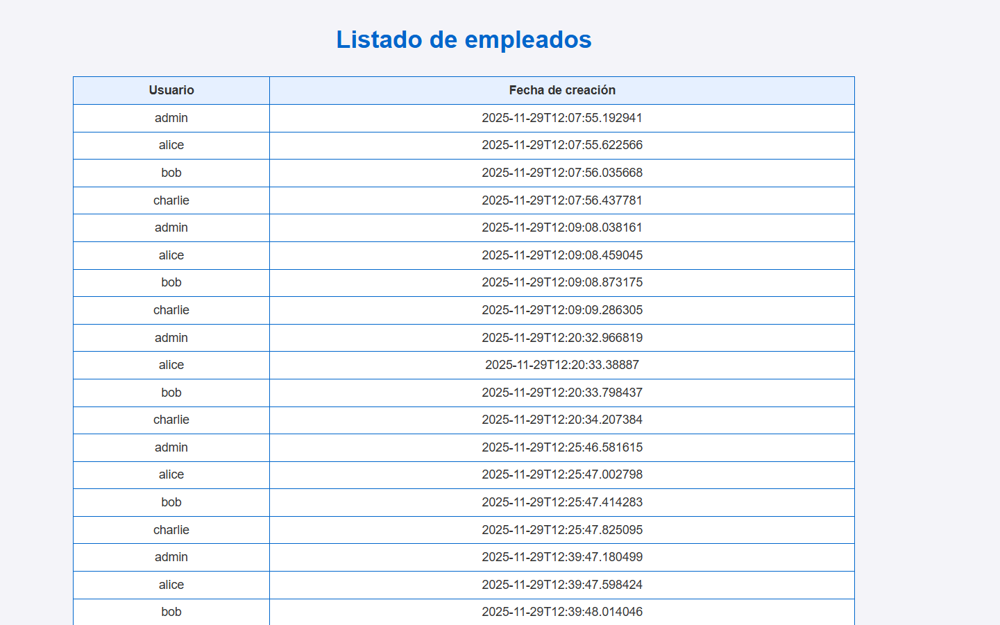

# 🧩 8: Proyecto Final — Automatización Completa de una Aplicación Web

## 🎯 Objetivo general

Al finalizar este módulo serás capaz de:

1. Integrar **Apache**, **Nginx** y **PostgreSQL** en un único proyecto automatizado.
2. Desplegar una **aplicación web dinámica** que lista empleados almacenados en PostgreSQL.
3. Aplicar todo lo aprendido: roles, handlers, plantillas, variables y buenas prácticas.
4. Construir un **playbook maestro** capaz de levantar una arquitectura completa de servidor web + reverse proxy + base de datos.

---

## 🛞 Comandos del ejercicio

Para iniciar el ejercicio, ejecuta:
```shell
lab start final
```

---

## 🏗️ Arquitectura del proyecto

```
+----------------+      +------------+      +------------+
│ Aplicación Web │ ---> │   NGINX    │ ---> │   APACHE   │
│ (empleados)    │      │  Reverse   │      │  WebServer │
+----------------+      +------------+      +------------+
                                                   │
                                                   ▼
                                             +------------+
                                             │ PostgreSQL │
                                             +------------+
```

---

## 📘 Estructura del proyecto

El proyecto final requiere **3 roles independientes**:

```
roles/
  postgresql/
  apache/
  nginx/
```

y un *playbook maestro*:

```
site.yml
```

---

## 📘 1. Role: postgresql

Usaremos lo contruido en el [tema 7: Gestión de Bases de Datos con PostgreSQL](config_databases.md).

Volver a configurar el puerto por defecto: **5432**

Añadimos **consulta dinámica** para obtener empleados desde Ansible en **postgresql/tasks/database.yml** y que el formato de salida sea un JSON:

??? tip "Solucion"
    **postgresql/defaults/main.yml** : `postgresql_port: 5433` → `postgresql_port: 5432`     

    Añadir en **postgresql/tasks/database.yml**:
    ```yaml
    - name: Obtener listado de empleados
      become: true
      become_user: postgres
      become_flags: -i
      ansible.builtin.shell:
        cmd: psql -p {{ postgresql_port }} -d "postgres" -t -A -F"," -c "SELECT json_agg(empleados ORDER BY id) FROM empleados;"
      register: employees_list
    ```

## 📘 2. Role: apache

Usaremos lo contruido en el [tema 6: Configuración de Servidores Web](config_webservers.md).

Volver a configurar el puerto por defecto: **8080**

Tendremos que modificar el template de **index.html** para que muestre el listado de empleados de variable `query_output`. Para ello:

- Crear el fichero **apache/tasks/deploy.yml**
- Mover la tarea de desplegar el template dentro
- Crear una tarea previa para recuperar la lista de empleados desde el contexto de db1 usando `hostvars`
- Convertir a objeto iterable **desde JSON** la variable que contiene la lista de empleados
- Añadir **deploy.yml** a **main.yml** dentro del rol de Apache

!!! info
    Las variables que definimos en tiempo de ejecución lo hacen en el **contexto del host**, para usarlas en otros contextos debemos usar su definición explicita: 
    ```
    hostvars['<nombre_servidor>']['<nombre_variable>']
    ```

??? tip "Solucion"
    **apache/defaults/main.yml** : `apache_port: 9090` → `apache_port: 8080`

    **apache/tasks/deploy.yml** :
    ```yaml
    - name: Recuperamos la lista de empleados desde el contexto de db1
      ansible.builtin.set_fact:
        employees_list: "{{ hostvars['db1']['employees_list']['stdout'] | from_json }}"

    - name: Desplegamos la pagina personalizada
      become: true
      ansible.builtin.template:
        src: index.html.j2
        dest: "{{ apache_docroot }}/index.html"
    ```

    **apache/tasks/main.yml** :
    ```yaml
    ---
    - name: Cargamos modulo de instalacion
      ansible.builtin.include_tasks: install.yml

    - name: Cargamos modulo de despliegue
      ansible.builtin.include_tasks: deploy.yml
    ```

    **apache/templates/index.html.j2** :
    ```html
    <!DOCTYPE html>
    <html lang="es">
    <head>
      <meta charset="UTF-8">
      <title>Listado de Empleados</title>
      <style>
        body {
          font-family: Arial, sans-serif;
          background-color: #f4f4f9;
          color: #333;
          text-align: center;
          padding-top: 50px;
        }
        h1 { color: #0066cc; }
        table {
          margin: 30px auto;
          border-collapse: collapse;
          width: 60%;
          background-color: #fff;
        }
        th, td {
          border: 1px solid #0066cc;
          padding: 8px;
        }
        th {
          background-color: #e6f0ff;
        }
      </style>
    </head>
    <body>
      <h1>Listado de empleados</h1>
      <table>
        <thead>
          <tr>
            <th>Usuario</th>
            <th>Fecha de creación</th>
          </tr>
        </thead>
        <tbody>
          
          <tr>
            <td>{{ emp.username }}</td>
            <td>{{ emp.created_at }}</td>
          </tr>
          
        </tbody>
      </table>
    </body>
    </html>
    ```

---

## 📘 3. Role: nginx

Tras cambiar el puerto por defecto en Apache, volver a configurar el puerto upstream a **8080**

??? tip "Solucion"
    **nginx/defaults/main.yml** : `nginx_upstream_port: 9090` -> `nginx_upstream_port: 8080`


---

## 📘 Playbook principal

Crear el playbook principal para orquestar todo el flujo.

!!! note
    Al tener mas de un servidor tenemos que añadir condiciones para
    que la lógica de webservers solo se lance en `web1` y la lógica
    de base de datos en `db1`, los servidores que generaba el laboratorio
    para cada tecnología

    ## Nota sobre el uso de grupos en el inventario de Ansible

    Cuando trabajamos con varios servidores, es importante estructurar correctamente el inventario de Ansible.
    Ansible permite **agrupar hosts** en categorías lógicas (por ejemplo, `webservers`, `dbservers`) y también crear **grupos compuestos** mediante `:children`.

    ```ini
    [webservers]
    web1 ansible_host=web1

    [dbservers]
    db1 ansible_host=db1

    [app:children]
    webservers
    dbservers
    ```
    ### ¿Qué significa este inventario?

    - **webservers**: contiene los nodos dedicados a servicios web.
    - **dbservers**: contiene nodos con bases de datos.
    - **app:children**: grupo que incluye automáticamente *todos los hosts* de `webservers` y `dbservers`.

    Esto permite ejecutar un playbook de forma más sencilla:

    ```sh
    ansible-playbook -i inventory app.yml
    ```

    El playbook se aplicará tanto sobre **web1** como **db1**, sin necesidad de enumerarlos individualmente.

**site.yml**
```yaml
---
- hosts: app
  gather_facts: true
  any_errors_fatal: true
  roles:
    - role: postgresql
      when: inventory_hostname == 'db1'
    - role: apache
      when: inventory_hostname == 'web1'
    - role: nginx
      when: inventory_hostname == 'web1'
```

!!! info
    El ejemplo mostrado anteriormente utiliza inventarios en **formato INI**, que es el más común y sencillo. Sin embargo, Ansible también permite definir inventarios en **YAML** y **JSON**, lo que aporta más flexibilidad y claridad en estructuras complejas.
    ```yaml
    all:
      children:
        webservers:
          hosts:
            web1:
              ansible_host: web1
        dbservers:
          hosts:
            db1:
              ansible_host: db1
        app:
          children:
            webservers: {}
            dbservers: {}
    ```

      - Ambos inventarios representan exactamente la **misma estructura lógica**.
      - El formato **YAML** es más verbose, pero muy útil cuando necesitas variables complejas, grupos anidados o definiciones extensas.
      - Ansible detecta automáticamente el formato según la **extensión del archivo**:
        + `.ini` → inventario clásico INI
        + `.yaml` / `.yml` → inventario YAML
        + `.json` → inventario JSON
      - [Documentación oficial: inventory_guide](https://docs.ansible.com/projects/ansible/latest/inventory_guide/intro_inventory.html)

---

## 🚀 Ejecución esperada

Tras ejecutar:

```shell
ansible-playbook site.yml
```

debes poder acceder desde tu navegador a:

```
http://localhost/
```

y ver una **lista dinámica de empleados** obtenida desde PostgreSQL (el número de entradas pueda variar según las veces que se lance en playbook)

{ width="700px" }
